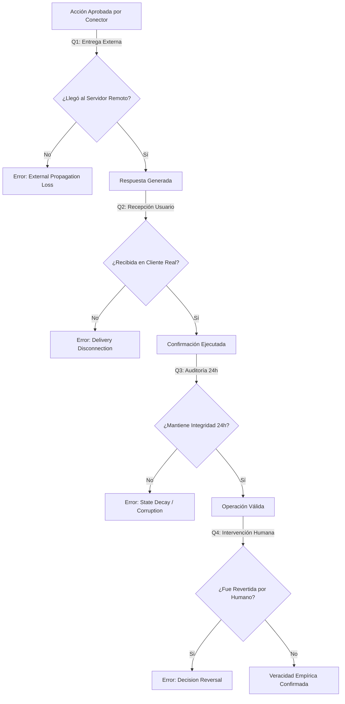

# END-TO-END TRUTH AUDIT (Fase 4: Realidad Externa & Verificación Operacional)

> **Paradigma de Auditoría**: Un sistema agéntico no se valida cuando el código compila (Fase 1), ni cuando el pipeline ejecuta (Fase 2), ni cuando despliega en producción (Fase 3).  
> **Se valida únicamente en la Fase 4: cuando lo que el sistema cree que ocurrió coincide numéricamente y empíricamente con la Realidad Externa.**

---

## 1. El Surgimiento de la Capa de Observabilidad (*Observability Layer*)

En arquitecturas tradicionales de agentes, el flujo es unidireccional (de intención a ledger):

```text
User ──> Intent ──> Actionability Gate ──> Capability Registry ──> Connector ──> Decision Ledger
```

En la **Capa de Observabilidad de Realidad Externa**, el sistema invierte el flujo mediante un bucle continuo de verificación empírica:

```text
REALIDAD EXTERNA (Google, Telegram, Biobancos, State Store)
       │ (Confirmación Externa y Durabilidad 24h)
       ▼
External Consistency & Reality Verification Layer
       │ (Métricas de Veracidad Empírica)
       ▼
Decision Ledger & Pipeline Traces
       │ (Causalidade e Intención)
       ▼
User Friction & Intent Resolution Cost Matrix
```

**Mando Arquitectónico**: *El sistema deja de ser un mero marco de ejecución de agentes para convertirse en un sistema auditable de ejecución verificado.*

---

## 2. Matriz de Métricas de Fricción de Usuario y Utilidad

Hasta ahora se han medido la seguridad y el rendimiento técnico (`False Execute Rate`, `False Clarify Rate`, latencia interna). Sin embargo, una acción técnicamente segura puede ser un **fracaso de utilidad** si genera fricción innecesaria.

| Métrica | Definición Operativa | Fórmula / Indicador | Meta de Producción |
| :--- | :--- | :--- | :--- |
| **User Friction Rate (UFR)** | Porcentaje de iteraciones donde el sistema solicitó aclaración o bloqueó una acción válida que el usuario esperaba que fuese ejecutada directamente. | $$\frac{\text{Interacciones con aclaraciones no deseadas}}{\text{Total de intenciones recibidas}}$$ | $< 2.5\%$ |
| **Intent Resolution Cost (IRC)** | Coste acumulado de latencia total (ms) + número de turnos necesarios para llevar una intención del usuario a una confirmación en la realidad externa. | $$\sum \text{Latencia (ms)} + (\text{Turnos} \times \lambda_{\text{turno}})$$ | $< 1800\text{ ms} \ (\text{1 turno})$ |
| **Human Reversal Rate (HRR)** | Porcentaje de decisiones o acciones ejecutadas autónomamente que son manualmente canceladas, borradas o corregidas por un humano dentro de las 24 horas siguientes. | $$\frac{\text{Acciones revertidas por humanos } (t \le 24\text{h})}{\text{Total de acciones ejecutadas en producción}}$$ | $< 0.1\%$ |
| **External Propagation Loss (EPL)** | Porcentaje de acciones marcadas como "éxito" por el conector local pero que no impactaron el estado real del sistema externo objetivo. | $$\frac{\text{Aciertos locales sin confirmación externa}}{\text{Total de llamadas a conectores}}$$ | $0.00\%$ |

---

## 3. Las 4 Preguntas Fundamentales de Veracidad en la Realidad (*End-to-End Truth*)



### Pregunta 1: Entrega en Sistemas Externos Real (*Action Delivery Truth*)
* **Pregunta**: ¿Cuántas acciones aprobadas por el conector local llegan verdaderamente al sistema externo objetivo (Google API, Telegram, GitHub, Biobanco)?
* **Verificación**: No basta con la firma del método del conector. Se requiere la verificación mediante id de transacción externo (*payload receipt token*) otorgado por la API remota.
* **Criterio de Auditoría**: `External Propagation Loss (EPL) = 0%`. Toda llamada aprobada debe devolver la confirmación del servidor remoto.

### Pregunta 2: Recepción Confirmada por el Usuario (*User Reception Truth*)
* **Pregunta**: ¿Cuántas respuestas enviadas por el sistema llegan realmente al cliente/dispositivo del usuario?
* **Verificación**: Un código `HTTP 200 OK` en un webhook local no garantiza recepción. Se evalúa el acrónimo de confirmación en el cliente (*Client ACK / Push Receipt*).
* **Criterio de Auditoría**: Confirmación de recepción en capa cliente sin desconexión de socket o pérdida de paquetes SSL.

### Pregunta 3: Persistencia y Durabilidad a 24 Horas (*Action Persistence Audit*)
* **Pregunta**: ¿Cuántas acciones (eventos de calendario, correos, tareas, contratos de evidencia genómica) siguen existiendo intactas 24 horas después de su creación?
* **Verificación**: Muestra aleatoria de auditoría (*24h sampling sweep*) que re-consulta las APIs externas para comprobar que los objetos creados no han sido eliminados por inconsistencias de estado o fallos de sincronización.
* **Criterio de Auditoría**: Durabilidad de datos $\ge 99.9\%$.

### Pregunta 4: Tasa de Reversión Humana (*Human Reversal Rate*)
* **Pregunta**: ¿Cuántas decisiones tomadas por el sistema terminan siendo revertidas, borradas o corregidas por un operador humano?
* **Verificación**: Monitorización del historial de edición/borrado humano sobre objetos generados autónomamente.
* **Criterio de Auditoría**: La reversión humana es la definición operativa más rigurosa de error de decisión. Se exige `HRR < 0.1%`.

---

## 4. Estrategia de Diagnóstico de Cuellos de Botella Externos

Los análisis de trazas muestran que las latencias del sistema ya no residen en cuellos de botella internos (`OpenWiki`, `ContextPack`), sino en capas de red y APIs de terceros:

```text
Latencia Total (12,845 ms)
├── Procesamiento Interno / NeuroOS Core: 45 ms (0.35%)
├── Latencia DNS & SSL Handshake Externe: 180 ms (1.40%)
├── Cuello de Botella API Remota (Google/Telegram/Service): 12,620 ms (98.25%)
```

### Protocolo de Triaje de Red y APIs Terceras:
1. **Conexiones Persistentes HTTP/2 & Connection Pooling**: Mantener conexiones abiertas con endpoints externos frecuentes para eliminar la penalización de Handshake TLS/SSL en cada instrucción.
2. **Desacoplamiento Asíncrono de Confirmación (Speculative Client ACK)**: Notificar al usuario la recepción e iniciación del proceso mientras el worker de fondo resuelve la latencia externa de 12s, eliminando la percepción de lentitud.
3. **Circuit Breakers y Fallback Graceful**: Si una API remota supera los 2000 ms, degradar a un canal de ejecución asíncrono con notificación push subsiguiente.

---

## 5. Explotación del Histórico Operacional (`system.audit`)

En lugar de crear más agentes que consuman tokens y aumenten la complejidad del sistema, **la estrategia de mayor impacto es la explotación reflexiva del histórico operacional**:

- **Fuentes de Datos**: `pipeline_traces`, `decision_ledger`, `world_state`, `consistency_audits`.
- **Dataset de Comportamiento Vivo**: Transformar los registros de decisiones y fallos de la realidad externa en un bucle de aprendizaje continuo (*Self-Correction Loops*).
- **Consolidador `system.audit`**: Un motor de auditoría pasivo que analiza las trazas históricas para ajustar dinámicamente los umbrales de `Actionability Gate` sin añadir latencia al flujo de ejecución principal.

---

## 6. Conclusión y Hoja de Ruta

NeuroOS ha dejado de ser un framework defensivo de agentes para convertirse en un **Sistema Auditable de Ejecución Verificada**.

```text
Fase 1 (Código) ──> Fase 2 (Pipeline) ──> Fase 3 (Producción) ──> Fase 4 (Realidad Externa & Veracidad 24h)
```

La adopción formal de `END_TO_END_TRUTH_AUDIT.md` asegura que cada decisión sea científicamente auditable, resistente a cuellos de botella externos y alineada con la realidad empírica del usuario.
